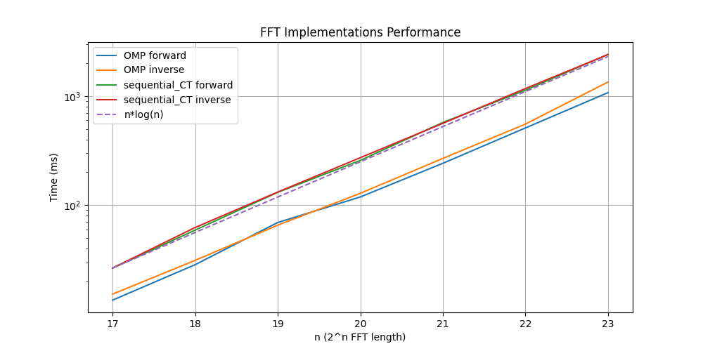
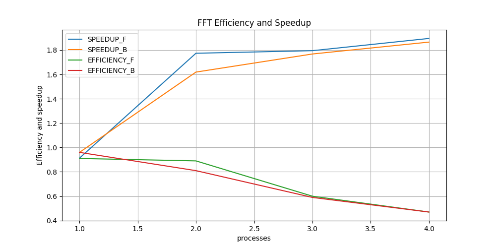

# BENCHMARK
This folder contains a collection of benchmark and plot scripts that allow to assess the library performance. It contains:
- [Speedup](./speedup/): allows to compare two different implementations and calculate the *speedup* with the respect to the sequential implementation ($T_S$). $S=\dfrac{T_S}{T_P}$
- [Efficiency](./efficiency/): Given an arbitrary dataset size, it allows to analyze the variation of the speedup when increasing the number of processors/threads ($P$) and calculate the associated *efficiency*. $E=\dfrac{S}{P}$
- [Plot](./plot/): allows to plot the results of the benchmarks.

## Speedup
`benchmark.sh`, `benchmark_2D.sh`, `benchmark_3D.sh` run multiple times a given test, increasing the dimension of the dataset at each iteration. Thanks to the `print_table` function it is possible to format the output in a table-format. 

From the *speedup* directory:

1. Use `source` command on the file that contains the printTable function:
```bash
$ source print_table.sh
```

2. Run the benchmark:
```bash
$ printTable "," "$(./benchmark.sh ../build/test_NAME.out [<MPI number of processes>] <Strategy header 1> <Strategy header 2>)"
``` 
Note that `<MPI number of processes>` should be specified only when testing an MPI-based strategy. This number should not be higher than the number of hardware-threads supported by your system.

For testing strategies of an higher dimension, use with the same parameters `benchmark2D.sh` and `benchmark3D.sh`.

OMP example:
```bash
$ printTable "," "$(./benchmark.sh ../build/test_OMP.out OMP SEQ)"
``` 
MPI example:
```bash
$ printTable "," "$(./benchmark.sh ../build/test_MPI.out 4 MPI SEQ)"
``` 


OMP Output:

  ```
  +     +              +                        +              +                        +             +             +                +                 +
  | n   | OMP forward  | Sequential_CT forward  | OMP inverse  | Sequential_CT inverse  | SU forward  | SU inverse  | error forward  |  error inverse  |
  +     +              +                        +              +                        +             +             +                +                 +
  | 17  | 32.3406 ms   | 40.5968 ms             | 28.6951 ms   | 40.5065 ms             | 1.25529     | 1.41162     | 0              | 0               |
  | 18  | 59.3229 ms   | 79.6577 ms             | 63.0702 ms   | 95.0078 ms             | 1.34278     | 1.50638     | 0              | 0               |
  | 19  | 176.704 ms   | 316.262 ms             | 143.96 ms    | 249.027 ms             | 1.78979     | 1.72984     | 0              | 0               |
  | 20  | 294.436 ms   | 597.204 ms             | 432.346 ms   | 772.512 ms             | 2.02829     | 1.78679     | 0              | 0               |
  | 21  | 916.679 ms   | 1.68532 s              | 929.48 ms    | 1.68258 s              | 1.83851     | 1.81024     | 0              | 0               |
  | 22  | 2.05282 s    | 3.64646 s              | 2.04079 s    | 3.89948 s              | 1.77632     | 1.91077     | 0              | 0               |
  | 23  | 4.4044 s     | 8.15379 s              | 3.29159 s    | 6.25814 s              | 1.85129     | 1.90125     | 0              | 0               |
  | 24  | 6.82353 s    | 13.2135 s              | 8.65403 s    | 14.358 s               | 1.93646     | 1.65911     | 0              | 0               |
  +     +              +                        +              +                        +             +             +                +                 +
  ```

## Efficiency
`efficiency.sh`, `efficiency_2D.sh`, `efficiency_3D.sh` run multiple times a given test on fixed dataset size, increasing the processors/threads number at each iteration. Thanks to the `print_table` function it is possible to format the output in a table-format.


From the *speedup* directory:

1. Use `source` command on the file that contains the printTable function:
```bash
$ source print_table.sh
```

2. Run the benchmark:
```bash
$ printTable "," "$(./efficiency.sh ../build/test_NAME.out N (M Z) <MAX number of processes>)"
``` 

The script will start with just one process/thread and then increasing by one at each iteration, or double it if the test requires a number of processes that is a power of two, until `MAX number of processes` is reached. 

For testing strategies of an higher dimension, use with the same parameters `efficiency2D.sh` and `efficiency3D.sh`.

```
  +    +            +            +               +               +
  | p  | SPEEDUP_F  | SPEEDUP_B  | EFFICIENCY_F  | EFFICIENCY_B  |
  +    +            +            +               +               +
  | 1  | 1.00677    | 0.982166   | 1.01          | 0.98          |
  | 2  | 1.87972    | 1.68708    | 0.94          | 0.84          |
  | 3  | 1.74599    | 1.76724    | 0.58          | 0.59          |
  | 4  | 1.88875    | 2.08915    | 0.47          | 0.52          |
  +    +            +            +               +               +
```

## Plot
Provides some Python scripts for plotting the results of the benchmark. You need the following packages: `matplotlib`, `numpy` and `pandas`.

From *plot* directory:

1. Time graph:

```bash
python plot_time.py test_NAME.out <Strategy header 1> <Strategy header 2> <dimension [1,2,3]> filename
```

for MPI-based test:
```bash
python plot_time_MPI.py test_NAME.out <NUM PROC> <Strategy header 1> <Strategy header 2> <dimension [1,2,3]> filename
```



2. Efficiency graph:
```bash
python3 plot_efficiency.py test_NAME.out <MAX NUM PROC> <dimension [1,2,3]> filaneme n (m z)

```
