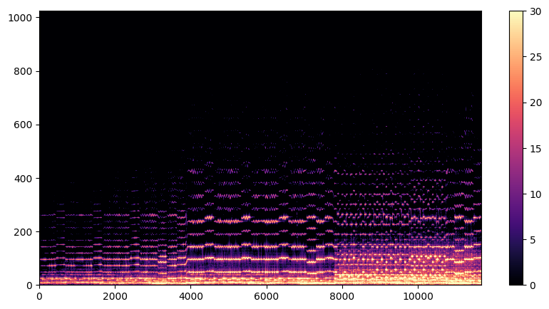
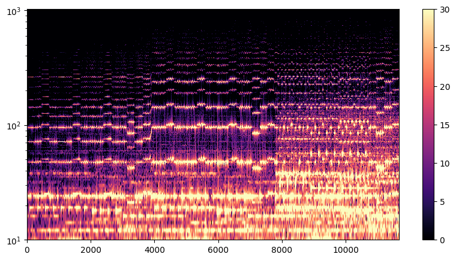

# Spectrogram application

The spectrogram application is a simple program that computes the spectrograms of a set of audio files. It is designed to be fast and easy to use. It relies on the [spectrogram module](../ffft/src/spectrogram/) of the FFFT library to compute the spectrograms.

## Compiling

The compile process is the same as for the FFFT tests. From root directory, run:

```bash
mkdir build
cd build
cmake -DFFTW3_DIR=your_fftw_installation_path (-DUSE_FAST_MATH=ON) ..
make spectrogram_app.out
```

The executable will be placed in the `build/spectrogram/` folder.

## Usage
### Computing the spectrograms
From the `build/` folder, run:
```bash
/spectrogram/spectrogram_app.out -i path_to_input_folder -o path_to_output_folder
```

The 2 command line arguments are optional. If not specified, the input folder will default to `spectrogram/wav_samples/`, where a few audio examples are provided. The files in the input folder must be in the `.wav` format in order to be processed. The output folder will default to `spectrogram/output/`.

The program will compute the spectrograms of all the `.wav` files in the input folder and save them in the output folder as `.txt` files.

### Plotting the spectrograms
In the `spectrogram/` folder, a simple python script named `plot_spectrogram.py` is provided to plot the spectrograms. It relies on the `matplotlib` library. To use it, go to the `spectrogram/` folder and run:
```bash
python plot_spectrogram.py path_to_output_folder [log]
```
where the last argument is optional. If specified, the spectrograms will be plotted with the frequency axis in logaritmic scale. This can be useful in some cases to better emphasize the musical tones.
If you used the default output folder, you can simply run the script from the `spectrogram/` folder with:
```bash
python plot_spectrogram.py output [log]
```

### Additional settings
The spectrogram application can be configured by editing the `spectrogram_app.cpp` file. The following settings are available:
- `FloatingType`: the floating point type used to compute the ffts. It can be set to `float` or `double`. The default value is `double`.
- `Strategy`: the strategy used to compute the ffts. It can be set to any 1-dimensional strategy available in the FFFT library (even the CUDA strategies if you built the library with CUDA support). 
- `FRAME_LENGTH`: the lenght of the frames in samples. It must be a power of 2. The default value is 1024.
- `STEP_SIZE`: the lenght at which subsequent frames are separated in samples. Default value is 128.

## Examples
The following examples are provided in the `spectrogram/wav_samples/` folder:
- `Violin.wav`: a short segment of "Experience" by Ludovico Einaudi, played by a violin.
- `Trumpet.wav`: a trumpet solo played by James Morrison.
- `Tuning_Fork_440Hz.wav`: a tuning fork playing the A4 note (440 Hz).

These are the spectrograms of the violin sample, the first one with a linear frequency axis, the second one with a logarithmic frequency axis:





